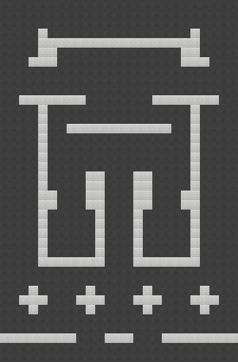
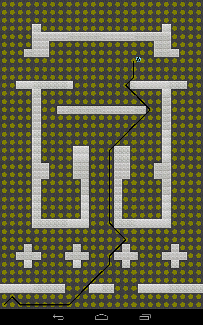

# Strategic Assault Simulator
An Android simulation game that relies on Neural Network controlled Agents, with extensive use of ![LibGDX] (http://libgdx.badlogicgames.com/).

This branch builds the basic architecture for the entire simulation, and a testbed for running different neural networks.

Visit the  to see current method for neural network agent training!

Example of an Agent created with 

Example of a Level created with 

Example of Interface Component in Action

# Installation Instructions 
( 1.0.2 Build 135.1653844)

(1) To install in Android Studio, begin by cloning the repository to your computer.  

(2) From the "Welcome to Android Studio" splash screen, select Import Non-Android Studio project

(3) Browse to cloned repository directory on your computer and select the build.gradle file in the root directory.  

(4) This should build the project.  Once complete, run in emulator or attached device!
